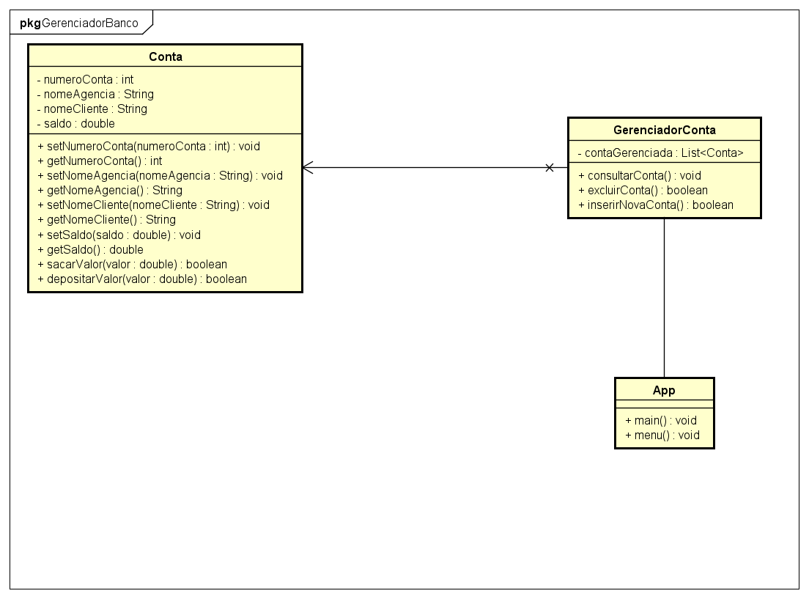

**Exercício de Programação Orientada a Objetos (POO)**

**ArrayList<Conta>**

**Título: Gerenciador de Contas Bancárias**

**Objetivo**

Implementar um sistema de gerenciamento de contas bancárias utilizando **Programação Orientada a Objetos (POO)** em **Java**. O sistema deverá permitir o cadastro de múltiplas** contas, operações bancárias básicas e a listagem das contas cadastradas. Os alunos devem utilizar a classe ArrayList para armazenar as contas criadas.

----------

**Requisitos do Sistema**

O sistema bancário deve ser capaz de:

1. **Cadastrar uma nova conta**
15. O usuário deverá fornecer as seguintes informações:
    1. Número da conta
    1. Nome da agência
    1. Nome do cliente
    15. Todas as novas contas iniciam com saldo zerado.
2. **Consultar os dados de uma conta específica**

15. O usuário informará o **número da conta** para exibir os detalhes dessa conta específica.

2. **Exibir todas as contas cadastradas**

15. O sistema deve listar todas as contas armazenadas, exibindo suas informações.
2. **Realizar depósitos**

   15. O usuário informará o **número da conta** e o **valor** a ser depositado.
   15. O saldo da conta deverá ser atualizado corretamente.
5. **Realizar saques**

   15. O usuário informará o **número da conta** e o **valor** a ser sacado.

15. O sistema deverá verificar se há saldo suficiente antes de permitir o saque.
    15. Caso o saldo seja insuficiente, o saque deve ser recusado.
6. **Excluir uma conta**

   15. O usuário informará o **número da conta** a ser excluída.
   15. O sistema removerá a conta da lista de contas armazenadas.
7. **Encerrar o programa**

   15. O usuário poderá escolher sair do programa a qualquer momento.

----------

**Critérios Técnicos**

- Criar uma **classe Conta** para representar as contas bancárias.

- Utilizar **atributos privados** e métodos getters e setters para manipulação dos dados.

- Implementar os métodos necessários para cada funcionalidade (ex.:

  depositar(), sacar(), etc.).

- Criar uma **classe principal (Main ou ContaTeste)** que utilize um ArrayList<Conta> para armazenar e gerenciar as contas.

- Utilizar **loops e estruturas condicionais** para implementar o menu de opções no console.

- A entrada de dados do usuário deve ser feita com a classe Scanner.

----------

## Desenvolvimento 

Diagrama inicial 

